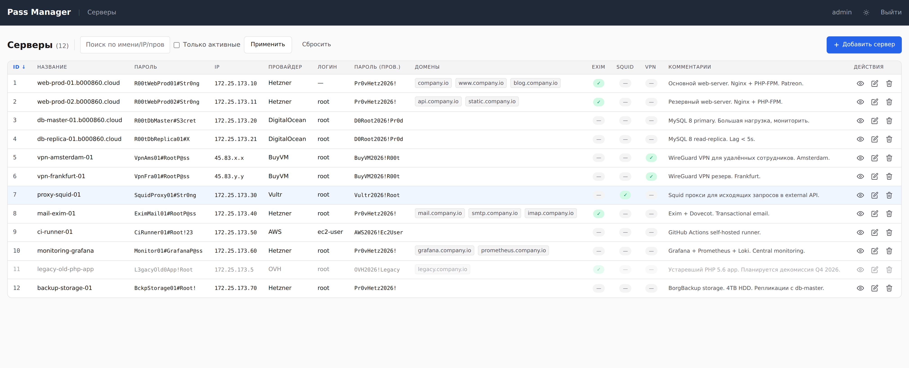

# Pass Manager

Веб-приложение для управления учётными данными серверов (замена старому PHP-одностраничнику `readme/vps2/`).



*Список серверов (демо-данные). Adaptive light/dark, инлайн-редактирование, HTMX.*

## Стек

- **Backend:** Flask 3.1 + SQLAlchemy + Flask-Login + Flask-WTF
- **DB:** SQLite
- **Auth:** LDAP (Active Directory) с fallback на локального admin
- **Frontend:** Jinja2 + HTMX + Tailwind CSS (CDN)
- **Production:** Gunicorn + nginx

## Структура

```
pass-manager/
├── app/
│   ├── __init__.py              # Application factory
│   ├── config.py                # Dev/Prod config (читает .env)
│   ├── extensions.py            # db, login_manager, csrf
│   ├── models.py                # User, Server, Domain
│   ├── forms.py                 # LoginForm (общие формы)
│   ├── auth/                    # Авторизация (LDAP + local)
│   │   ├── views.py
│   │   └── ldap_auth.py
│   └── servers/                 # CRUD серверов + HTMX
│       ├── views.py
│       └── forms.py
├── app/templates/               # Jinja2 шаблоны
├── scripts/
│   ├── init_db.py               # Создание таблиц
│   ├── seed_admin.py            # Создание local admin
│   └── migrate_from_mysql.py    # Импорт из legacy MySQL
├── nginx/pass-manager.conf      # Пример nginx-конфига
├── run.py                       # Точка входа (dev)
├── gunicorn.conf.py             # Production config
├── requirements.txt
└── .env.example
```

## Роли RBAC

| Роль          | Описание                              | Видит пароли |
|---------------|----------------------------------------|--------------|
| `superadmin`  | Полный доступ, управление ролями       | Да           |
| `admin`       | Управление серверами, онбординг        | Нет          |

`admin` не может ни просматривать, ни редактировать поля, в названии которых есть `password` или `pass` — это доступно только `superadmin`.

Если у вас существующая БД с ролями `pass-admin`/`pass-lead`/`pass-user`, прогоните `python scripts/migrate_to_track_c.py` (сначала с `--dry-run`, затем без него).

## Быстрый старт (dev)

```bash
# 1. Виртуальное окружение
python3 -m venv venv
source venv/bin/activate

# 2. Зависимости
pip install -r requirements.txt

# 3. Конфиг
cp .env.example .env
# Отредактируйте SECRET_KEY, при необходимости — LDAP_*

# 4. Инициализация БД
python scripts/init_db.py

# 5. Создание local admin
python scripts/seed_admin.py

# 6. Запуск
python run.py
# → http://127.0.0.1:5001
```

## Миграция данных из старой MySQL БД

Поддерживается два режима:

### А) Из .sql дампа (mysqldump)

```bash
python scripts/migrate_from_mysql.py --dump /path/to/vps.sql --reset
```

### Б) Из живой MySQL

```bash
pip install pymysql
export MYSQL_HOST=... MYSQL_USER=... MYSQL_PASSWORD=... MYSQL_DB=vps
python scripts/migrate_from_mysql.py --live --reset
```

Флаг `--dry-run` — вывести действия без записи в БД.

## LDAP-авторизация

Настройки задаются в `.env`. Полный их список с пояснениями — в `.env.example`, он же
единственный источник истины: дублировать перечень здесь не надо, он разъезжается.

Два требования, которые из примера конфигурации не читаются:

- **LDAPS обязателен** (`LDAP_USE_SSL=true`, порт 636). При простом bind по 389 пароль
  сотрудника уходит по сети открытым текстом, а через эту авторизацию входят все.
- **Сертификат контроллера домена проверяется всегда.** Для внутреннего удостоверяющего
  центра нужен путь к его корневому сертификату в `LDAP_CA_CERT_FILE` — контроллер сам его
  в цепочке не присылает. Если ключи в цепочке слабее RSA-2048, OpenSSL отвергнет её даже
  при валидной подписи: на такой случай есть `LDAP_TLS_CIPHERS`, и он понижает уровень
  проверки, но не отключает её.

Служебная учётная запись (`LDAP_BIND_DN`) обязательна: ею находят пользователя в каталоге,
а его пароль проверяется отдельным bind'ом от его же имени и учётке не передаётся.

LDAP используется только для аутентификации (auth-only). Роль не определяется через AD-группы — она хранится в БД pass-manager и назначается вручную (`superadmin` может менять роль пользователя).

Алгоритм:
1. Bind под service account → поиск пользователя по `sAMAccountName`.
2. Bind под найденным DN и паролем пользователя (проверка пароля).
3. Новый пользователь создаётся с ролью `admin`; при повторном входе роль из БД не перезаписывается.
4. Если LDAP недоступен или `LDAP_SERVER` пуст — fallback на local admin из `.env`.

## Production-деплой на b000860

```bash
# 1. Клонировать репозиторий
git clone <repo> /opt/pass-manager
cd /opt/pass-manager

# 2. Окружение
python3 -m venv venv
source venv/bin/activate
pip install -r requirements.txt

# 3. .env (production!)
cp .env.example .env
# Заполнить реальными значениями, сгенерировать SECRET_KEY:
python -c "import secrets; print(secrets.token_hex(32))"

# 4. Инициализация и seed
FLASK_CONFIG=production python scripts/init_db.py
FLASK_CONFIG=production python scripts/seed_admin.py

# 5. Миграция данных
FLASK_CONFIG=production python scripts/migrate_from_mysql.py --dump /path/legacy.sql --reset

# 6. systemd unit (пример)
cat > /etc/systemd/system/pass-manager.service <<'EOF'
[Unit]
Description=Pass Manager (gunicorn)
After=network.target

[Service]
User=www-data
Group=www-data
WorkingDirectory=/opt/pass-manager
EnvironmentFile=/opt/pass-manager/.env
ExecStart=/opt/pass-manager/venv/bin/gunicorn -c gunicorn.conf.py "run:app"
Restart=on-failure

[Install]
WantedBy=multi-user.target
EOF

systemctl enable --now pass-manager

# 7. nginx
cp nginx/pass-manager.conf /etc/nginx/sites-available/
ln -s /etc/nginx/sites-available/pass-manager.conf /etc/nginx/sites-enabled/
nginx -t && systemctl reload nginx
```

## Интеграция (Фазы B/C)

В планах:
- **Фаза B** — обращение к VPS Manager по API при добавлении сервера
  (генерация SSH-ключей, ротация root-пароля).
- **Фаза C** — запуск Ansible playbooks через `ansible-runner` для установки
  сервисов exim/squid/vpn.

Эти фазы будут добавлены отдельными blueprint-ами (`integration/`, `automation/`)
без переделки Фазы A.

## Безопасность

- Секреты серверов (`password`, `provider_password`, `web_pass`, `mgt_pass`) шифруются
  **Fernet** на уровне столбцов (колонки `*_encrypted`) через `encrypt()/decrypt()` из
  `app/security.py`. Требуется `ENCRYPTION_KEY` в `.env` (см. `.env.example`).
- Пароль локального admin хранится хешем (werkzeug `generate_password_hash`), не в открытом виде.
- RBAC: `admin` не видит и не может редактировать поля паролей (см. таблицу ролей выше).
- `.env` **никогда** не коммитить (см. `.gitignore`); БД (`instance/`) тоже вне git.
- CSRF-токен встроен во все формы и прокидывается в HTMX-запросы.
